<script lang="ts">
    import { Notice } from '@stackoverflow/stacks-svelte';

    import Grid from '$components/Grid.svelte';
    import GridColumn from '$components/GridColumn.svelte';
</script>

<div class="d-flex g4 ai-center mb24">
    <span class="s-badge fc-purple-500 bg-purple-100">@stackoverflow/stacks-email v{__EMAIL_VERSION__}</span>
</div>

## Introduction

Emails are a great opportunity to showcase the brand’s personality to loyal users or perspective customers who may otherwise only interact with the product itself.

From transactional updates to editorial moments, every email is a chance to strengthen familiarity with the brand and build a more connected experience.

These guidelines are designed to provide a foundation for what those emails can be, while leaving room to evolve and expand over time.

## Creating emails

Our documentation is built from components built with [MJML](https://mjml.io/) – an open-source email framework that abstracts away the need to manually code email HTML. [Read the full documentation](https://documentation.mjml.io).

## Templates

We have a range of email templates, each serving a distinct purpose while demonstrating how communication can scale from functional to expressive.

<div class="d-flex ai-center my32">
    <strong class="ta-left flex--item">
        Functional
    </strong>
    <span class="ta-center h4 bg-black w100 fc-white mx24">
       —
    </span>
    <strong class="ta-right">
        Expressive
    </strong>
</div>

<Grid>
    <GridColumn padding={false} extraClasses="docs-index-card">

[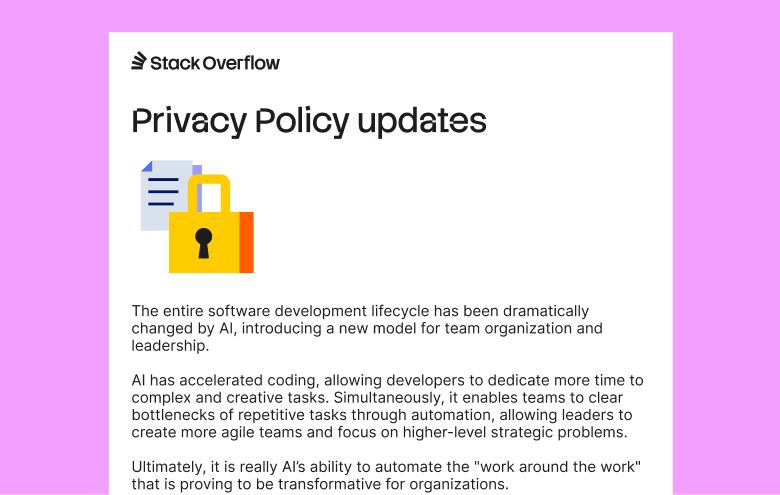](./templates/transactional)

### [Transactional](./templates/transactional)

A transactional email is functional. It is triggered by an event and usually is a short single message and call to action.

    </GridColumn>
    <GridColumn padding={false} extraClasses="docs-index-card">

[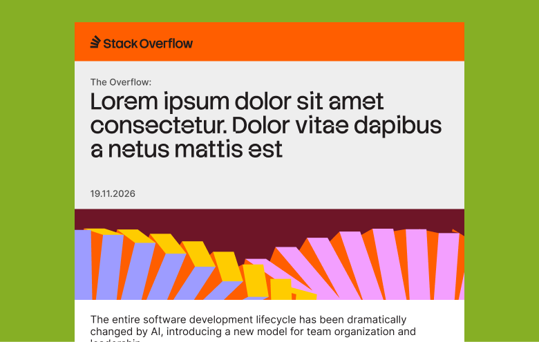](./templates/newsletter)

### [Newsletter](./templates/newsletter)

A newsletter is a recurring pieces of comms that may contain various items and call to actions.

    </GridColumn>
    <GridColumn padding={false} extraClasses="docs-index-card">

[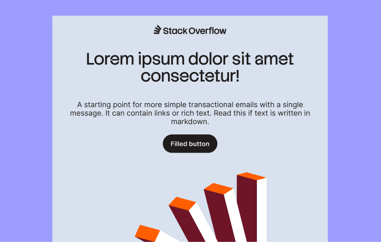](./templates/promotional)

### [Promotional](./templates/promotional)

Typically single-message communications - short, punchy, and to the point — designed to quickly capture attention and drive engagement.

    </GridColumn>

</Grid>

## Components

Each email is built from reusable component blocks. The set below is the canonical starting library.

<Grid>
    <GridColumn padding={false} extraClasses="docs-index-card">

[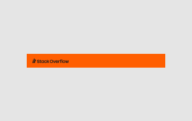](./components/header)

### [Header](./components/header)

Top brand strip and utility nav variations.

    </GridColumn>
    <GridColumn padding={false} extraClasses="docs-index-card">

[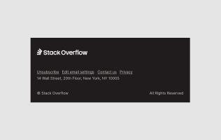](./components/footer)

### [Footer](./components/footer)

Legal metadata and recipient preference links.

    </GridColumn>
    <GridColumn padding={false} extraClasses="docs-index-card">

[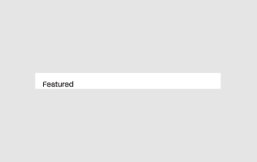](./components/title)

### [Title](./components/title)

Section title treatments.

    </GridColumn>
    <GridColumn padding={false} extraClasses="docs-index-card">

[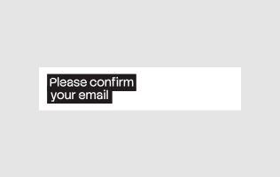](./components/headline)

### [Headline](./components/headline)

Large hero headline treatments.

    </GridColumn>
    <GridColumn padding={false} extraClasses="docs-index-card">

[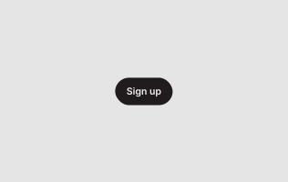](./components/button)

### [Button](./components/button)

Reusable CTA primitive used across blocks.

    </GridColumn>
    <GridColumn padding={false} extraClasses="docs-index-card">

[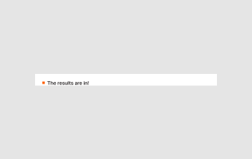](./components/subtitle)

### [Subtitle](./components/subtitle)

Supporting labels and secondary lines.

    </GridColumn>
    <GridColumn padding={false} extraClasses="docs-index-card">

[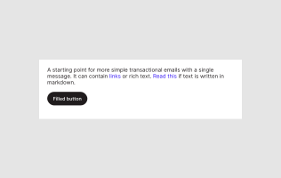](./components/text)

### [Text](./components/text)

Body copy plus alert, quote, and highlight component examples.

    </GridColumn>
    <GridColumn padding={false} extraClasses="docs-index-card">

[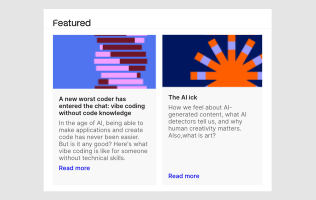](./components/cards)

### [Cards](./components/cards)

Simple, link, and CTA card layouts.

    </GridColumn>

    <GridColumn padding={false} extraClasses="docs-index-card">

[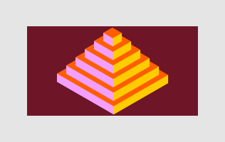](./components/graphic)

### [Graphic](./components/graphic)

Standalone illustration placeholder block.

    </GridColumn>
    <GridColumn padding={false} extraClasses="docs-index-card">

[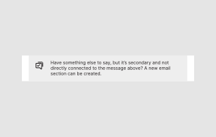](./components/callout)

### [Callout](./components/callout)

Indented and visually distinct box for alerts or important information.

    </GridColumn>
    <GridColumn padding={false} extraClasses="docs-index-card">

[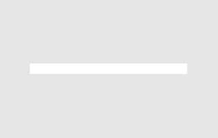](./components/spacer)

### [Spacer](./components/spacer)

Preset vertical rhythm utilities.

    </GridColumn>

</Grid>

## Usage

<Notice variant="warning" class="s-anchors s-anchors__inherit s-anchors__underlined">
    <p><strong>Warning:</strong> This functionality is experimental and may change.
</Notice>

If you are running the `@stackoverflow/stacks-email` package, you can compose and render email markup by POSTing a JSON block list to the compile API.

### POST /api/compile

**Paramaters**

- `template`: currently supports `"transactional"`.
- `target`: one of `"preview"`, `"dotnet"`, or `"braze"`.
- `blocks`: ordered array of block definitions.
- `previewText`: optional template preheader/inbox snippet text.

**Example request:**

```json
{
    "template": "transactional",
    "target": "preview",
    "previewText": "Reset your password in one click.",
    "blocks": [
        {
            "type": "headline",
            "variant": "highlight",
            "props": {
                "textContent": "Reset your password"
            }
        },
        {
            "type": "text",
            "variant": "body",
            "props": {
                "textContent": "Hi [[FIRST_NAME]], click below to continue."
            }
        },
        {
            "type": "button",
            "variant": "primary",
            "props": {
                "href": "[[CTA_URL]]",
                "text": "Reset password"
            }
        }
    ]
}
```

<br/>

**Response**

Successful responses include compiled `html`, final `mjml`, `renderedMjml`, compile `errors`, and metadata such as `template`, `target`, and `blockCount`.

<br/>

## Target clients

[Litmus](https://www.litmus.com/) publishes a regularly updated list of [email clients and their observed market share](https://www.litmus.com/email-client-market-share), you can use this as a rough guideline when testing and making decisons about compatability.

| Client         | Share (%) |
| -------------- | --------- |
| Apple          | 45.51     |
| Gmail          | 23.54     |
| Outlook        | 5.67      |
| Yahoo Mail     | 2.06      |
| Google Android | 1.34      |
| Outlook.com    | 0.40      |
| Thunderbird    | 0.17      |
| Orange.fr      | 0.08      |
| Bell Email     | 0.02      |
| Samsung Mail   | 0.02      |

<br/><br/>

## Other resources

### [Email gallery](https://email.stackoverflow.design/)

[email.stackoverflow.design](https://email.stackoverflow.design/)

Our own gallery of email designs. [These templates](https://github.com/StackExchange/Stacks/tree/main/packages/stacks-email/templates) are used to build the examples in this section lives along side the [email components](https://github.com/StackExchange/Stacks/tree/main/packages/stacks-email/components) so feel free to add your templates back in to serve as inspiration for others.

### [Can I email?](https://www.caniemail.com/)

[caniemail.com](https://www.caniemail.com/)

On occasion you may need to hard code some elements of email, if straying from the components here or implementing something ourside of the scope of MJML. ‘Can I email’ is a great resource for dealing with the eccentricities of email development.

### [Really Good Emails](https://reallygoodemails.com/)

[reallygoodemails.com](https://reallygoodemails.com/)

A constantly evolving gallery of email designs from across the web. Espeically useful for designers or product managers planning out a new email.
