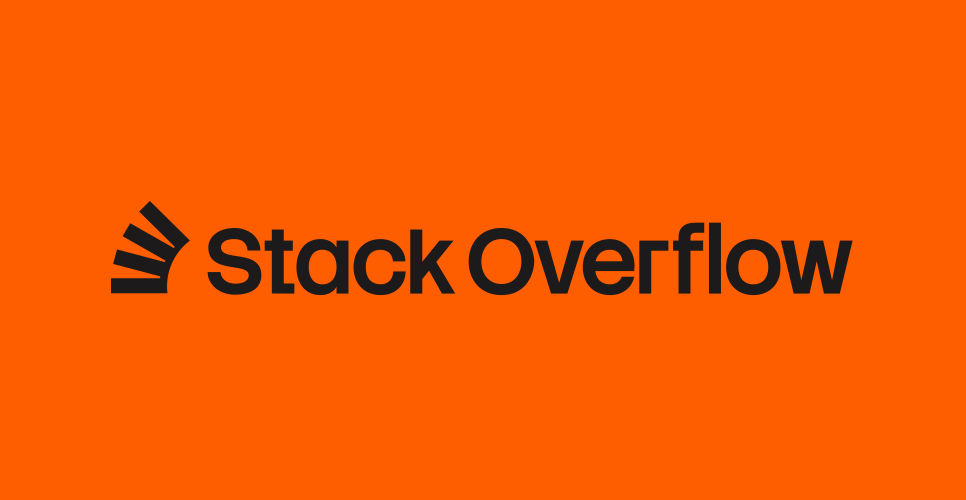
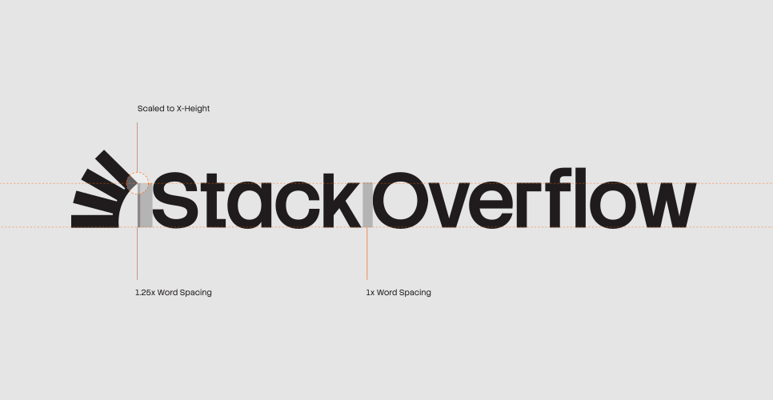
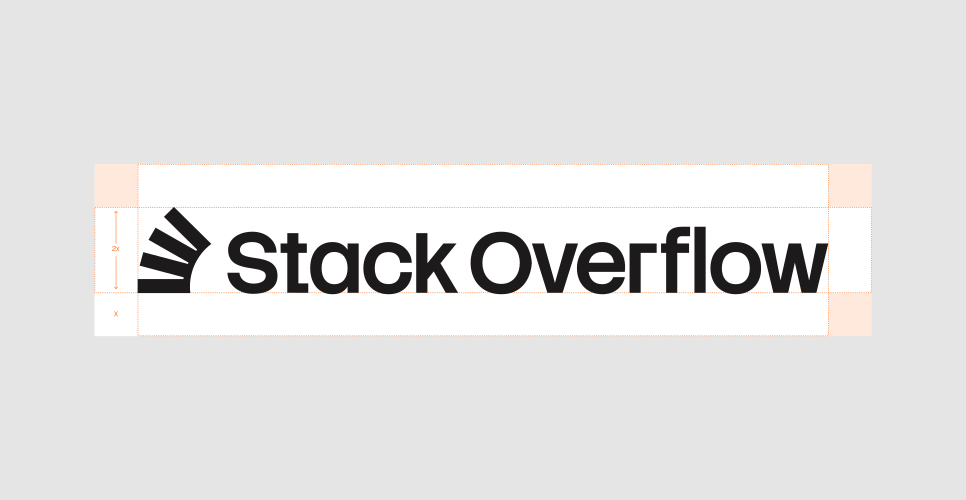
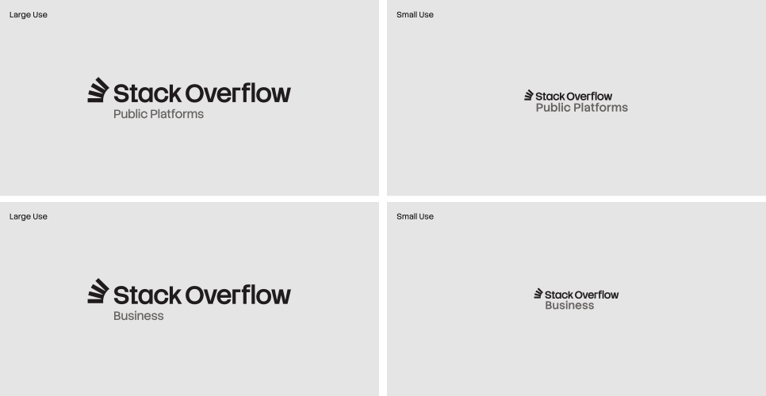
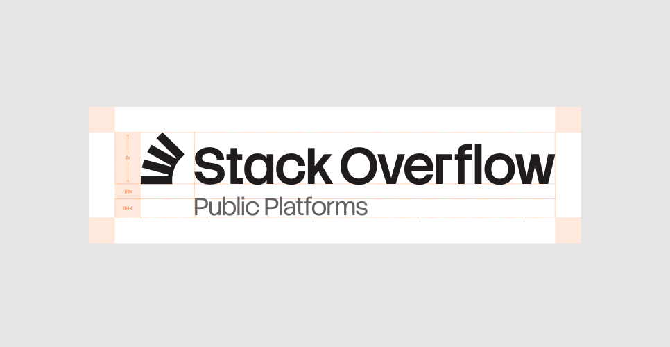
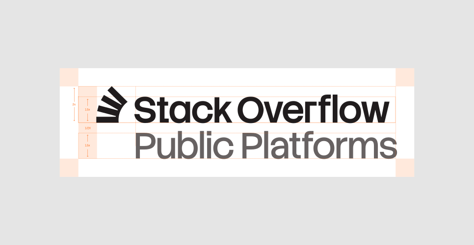
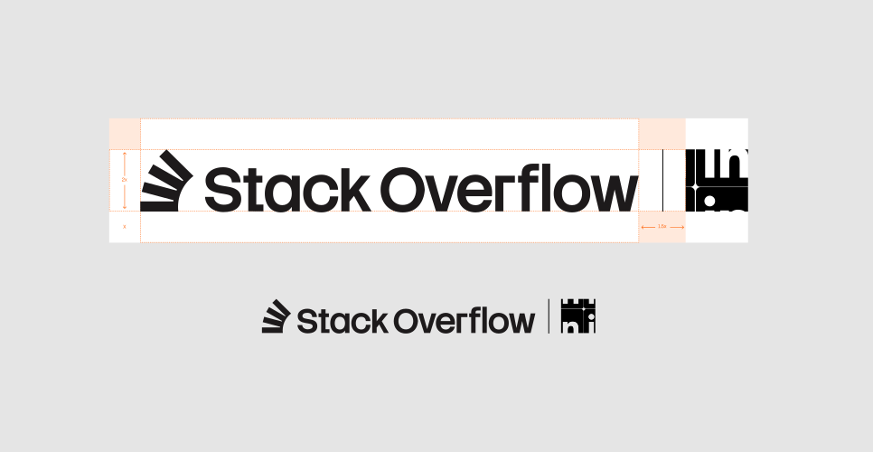
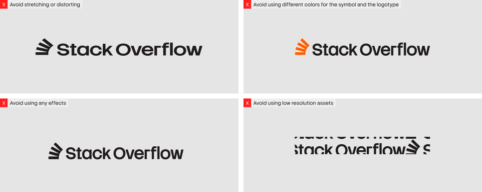
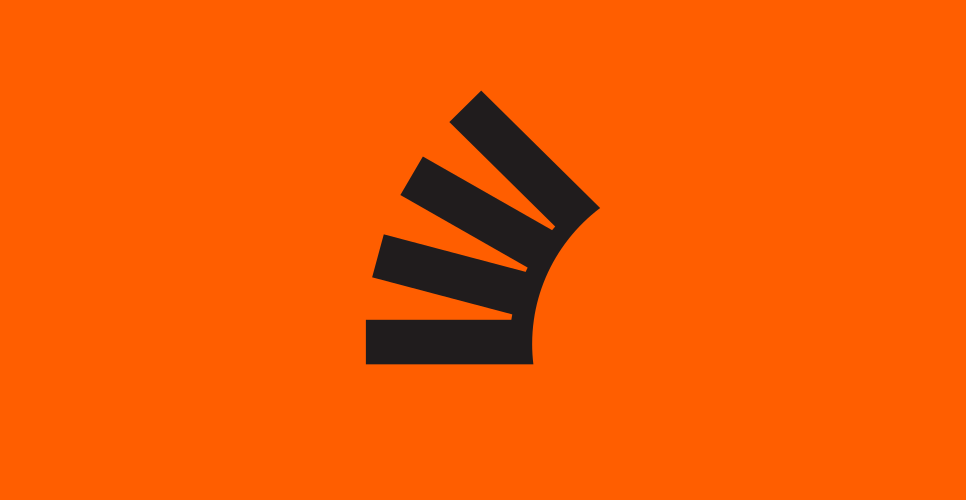

Our logo is the core identifier of Stack Overflow and one of the most visible expressions of our brand. It represents our community and our products. To protect its integrity, it must always be used consistently, with proper clear space, proportions, and placement.

<Button rel="external" target="_blank" href="https://drive.google.com/drive/folders/1BFngjCdvgmVowR30qjj4RV6e_aWjGOUc">
  Download logos
</Button>

## Primary lockup

Our logo is the core identifier of Stack Overflow and one of the most visible expressions of our brand. It represents our community and our products. To protect its integrity, it must always be used consistently, with proper clear space, proportions, and placement.

## Logo architecture

## Color combinations

Our preference is to use the logo in Off-Black. Where accessibility makes this unsuitable, you can use Off-White instead.

<LogoColors />

## Logo clearspace

## Page format lockups

When using this horizontal lockup, follow the guidance below on where to place the logo on a composition.

<LogoFormatLockups />

## Sub-brand lockups

We have two approaches to sub-brand lockups. The approach you use should be determined by the scale at which the lockup is going to appear.

## Sub-brand large usage

Use the diagram below to determine how sub-brand lockups, used at a large scale, should be created.

## Sub-brand small usage

Use the diagram below to determine how sub-brand lockups, used at a large scale, should be created.

## External partnership lockups

External partnerships use a simpler lockup, where the height of both logos should always align.

## Things to avoid

## Symbol

## Symbol lockup

Where the Stack Overflow name is already present (e.g. social media profiles) or within the Stack Overflow ecosystem (e.g. product) you can use the symbol. Always follow the clearspace guidance below to make sure you correctly scale and center the symbol in application.

<LogoSymbol />
