

Our brand font defines the voice of our visual identity and brings character to every expression. Rooted in modernist inspiration yet enriched with traditional motifs, it strikes a balance between timelessness and innovation. Its distinctive notched detailing sets it apart, creating a recognizable signature that builds equity across every touchpoint. In this section, you'll find guidance on how to apply the font effectively, the typographic hierarchy to follow, and key considerations to ensure clarity, consistency, and impact.

| Variation                                                                                        | Use                                    | Download                                                                                                          |
| ------------------------------------------------------------------------------------------------ | -------------------------------------- | ----------------------------------------------------------------------------------------------------------------- |
| Stack Sans Notch | Hero headlines and display text        | <Button size="xs" href="https://fonts.google.com/specimen/Stack+Sans+Notch">Available on Google Fonts</Button>    |
| Stack Sans Headline    | Headers and titles (i.e., larger uses) | <Button size="xs" href="https://fonts.google.com/specimen/Stack+Sans+Headline">Available on Google Fonts</Button> |
| Stack Sans Text           | Body copy (i.e., smaller uses)         | <Button size="xs" href="https://fonts.google.com/specimen/Stack+Sans+Text">Available on Google Fonts</Button>     |

## Primary typeface

Our primary typeface is called **Stack Sans**. Crafted uniquely for Stack Overflow, it combines robust grotesque forms with modern styling, to produce a font that feels distinctly us.

**Stack Sans** is licensed under the [SIL Open Font License (OFL) v1.1](https://openfontlicense.org/), this means you are free to use it in books, posters, artwork, logos, and on websites, even make 3D objects with the outlines — no acknowledgement is required. However there are [some conditions](https://openfontlicense.org/how-to-use-ofl-fonts) to follow if you are bundling it in apps or software.

<TypographyWeights />

<Grid>
  <GridColumn extraClasses="bg-brand-yellow">
    
    
Distinct x, cap and ascender heights used for character distinction. High x-height for increased legibility.

  </GridColumn>
  <GridColumn extraClasses="bg-brand-purple">
    
    
Even spacing ensures consistent rhythm, aiding word recognition and improving accessibility.

  </GridColumn>
  <GridColumn extraClasses="bg-brand-pink">
    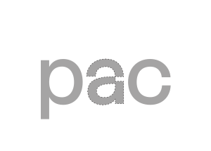
    
Distinct forms for lowercase letters, to increase legibility at smaller scales.

  </GridColumn>
</Grid>

## Glyph set

Our full glyph set contains 509 characters and supports 464 languages. Every letterform has been crafted with care and consistency, ensuring our words always appear strong, refined, and considered.

<TypographyCharacter />

## Stylistic sets

Stack Sans contains two stylistic sets. The standard set and a notched set. Our notched set reflects the character found in our logo. Off-kilter tittles and notched segments of letterforms create a font that feels like it’s mid-build.

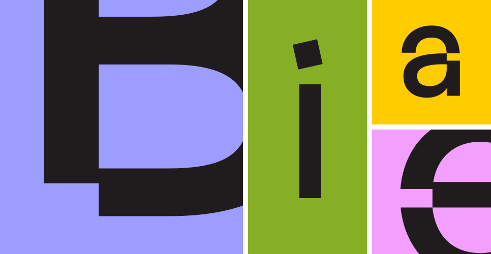

## Choosing the correct stylistic set

Our stylistic sets should be used with care. Set B, the notched set, is reserved for large headlines of 30pt and above, as its unique characteristics can cause legibility issues at smaller sizes.

<TypographyNotch />

## Alignment

Across the brand system, text should only be left-aligned or center-aligned.Center alignment is typically reserved for more expressive layouts.

<TypographyAlignment />

## Margins

Consistent margins ensure consistent layouts across the brand. To calculate the margin, add the two side lengths of the layout and set the margin to 2% of that total.

<code>
(Side A + Side B) X 0.02 = Margin
</code>

<TypographySpacing />

### Things to avoid

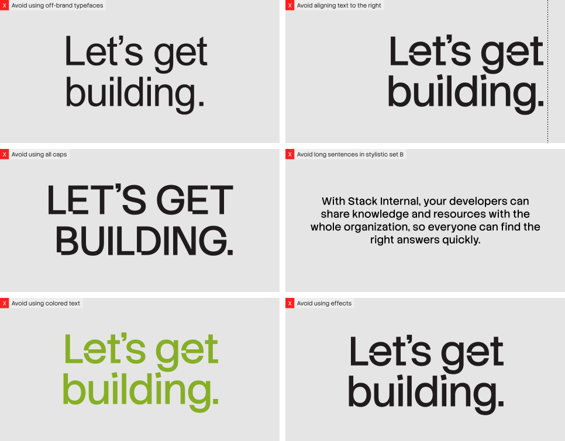

## Highlighted headlines

Within our system, we use headline-only highlighted text. It is always left-aligned and comes in two styles: monotone for a clean, consistent look, and duotone when part of a headline needs emphasis.

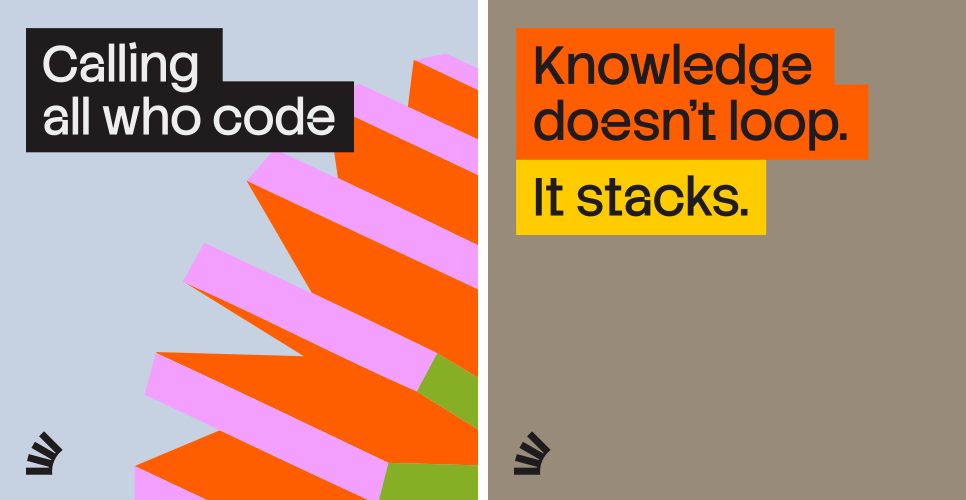

### Monotone highlight construction

When constructing monotone assets, line height should always be set to 105% to ensure neat alignment. The margins of the highlighter box must equal half the cap height of the headline. For example, if the headline height is 50px, the highlighter box margin should be 25px.

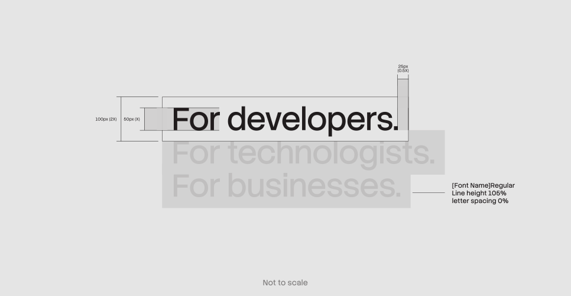

### Duotone highlight construction

Duotone assets are slightly more complex as the text must be segmented. For ease of use, the highlighted portion should remain within a single line. Beyond this, the same rules apply. Refer to the diagram below to see how it comes together.

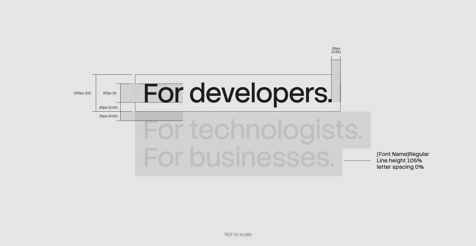

### Things to avoid

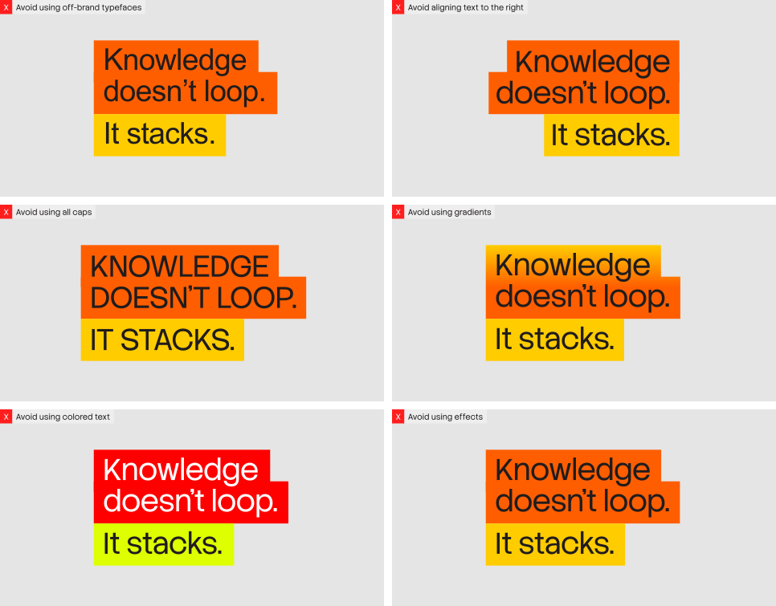

## Integrating typography and Stacks

To bring more energy into our typography, we can integrate it with our 3D stacks. This allows headlines to feel more dynamic within the system. We approach this in two ways: construction, where type builds onto the forms, and obstruction, where type is broken up by them.

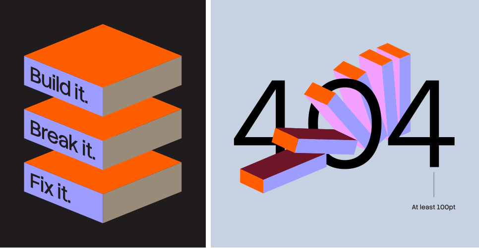

### 3D type construction

When constructing our 3D type blocks, we use the same method and specifications as highlighted headlines. The only additional step is applying the [Skew Skew plugin in Figma](https://www.figma.com/community/plugin/1295667411756432452/skew-skew), in this case set to 22 degrees, to match the angles of our 3D forms.

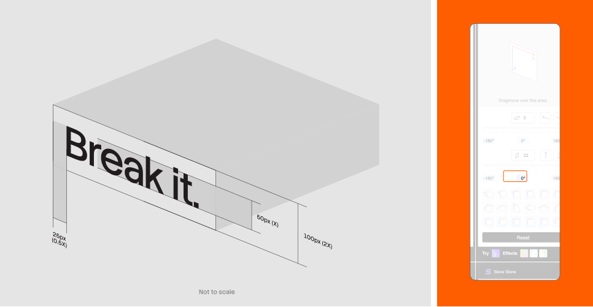

### 3D type obstruction

When obstructing typography, we work in three layers: foreground, midground, and background. The simplest way to achieve this effect is by breaking up the 3D vector itself. To maintain legibility, this treatment should only be applied to very large headlines, and no more than 50% of any letterform may be obstructed.

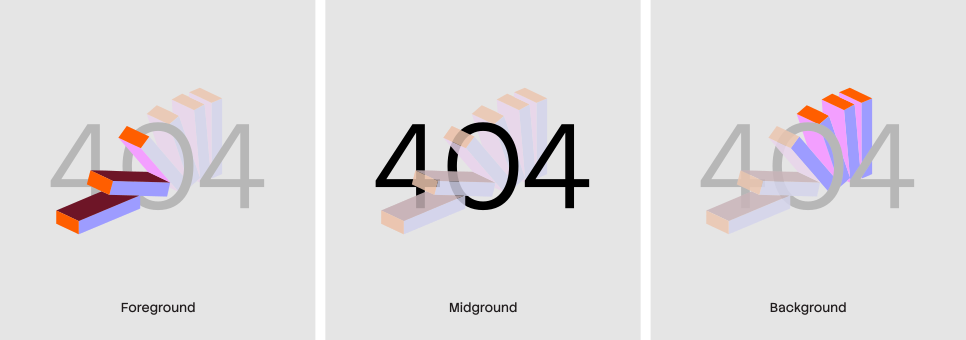

### Things to avoid

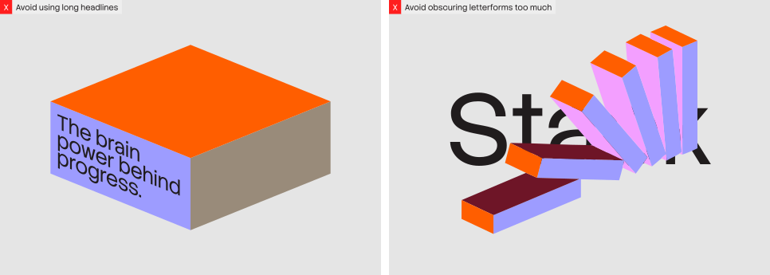
