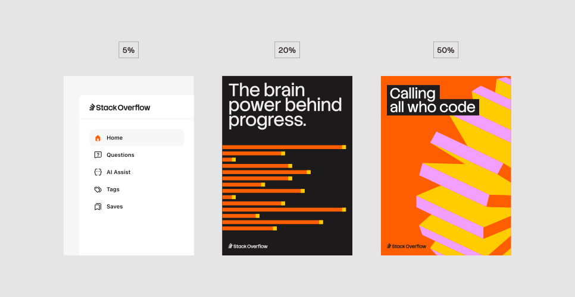
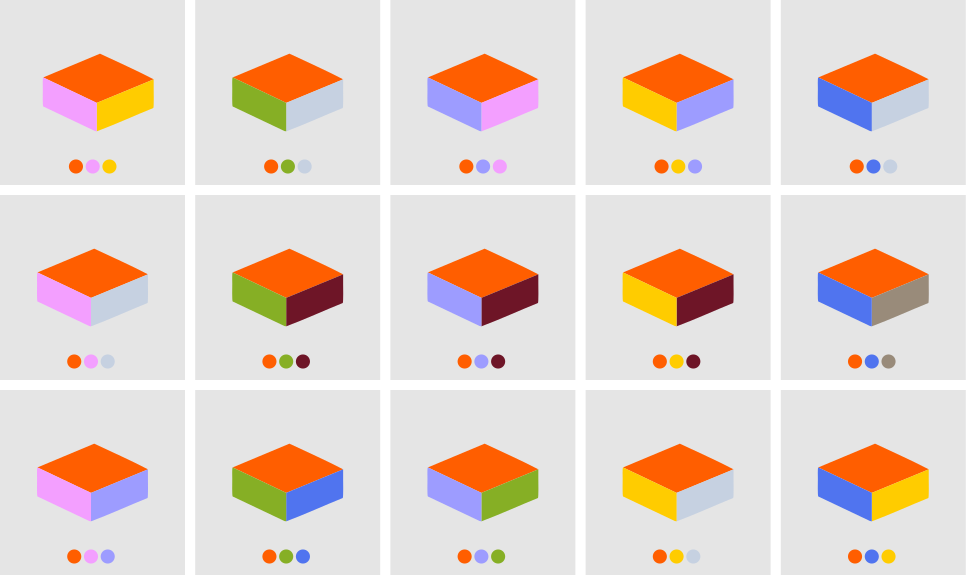
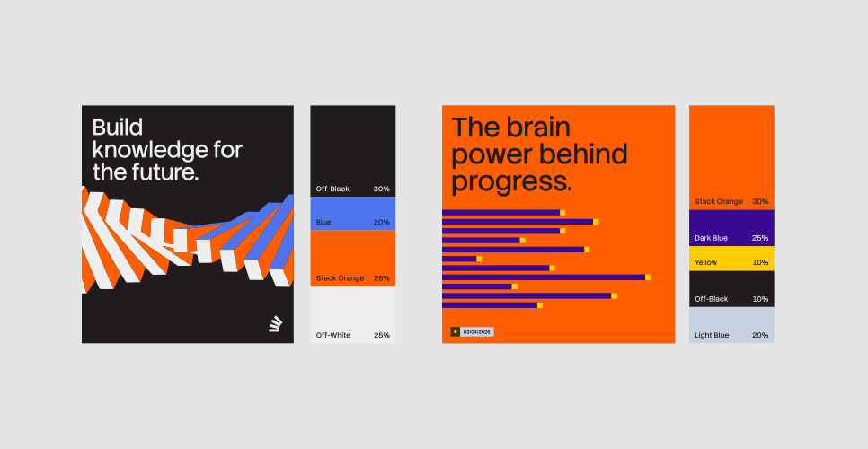
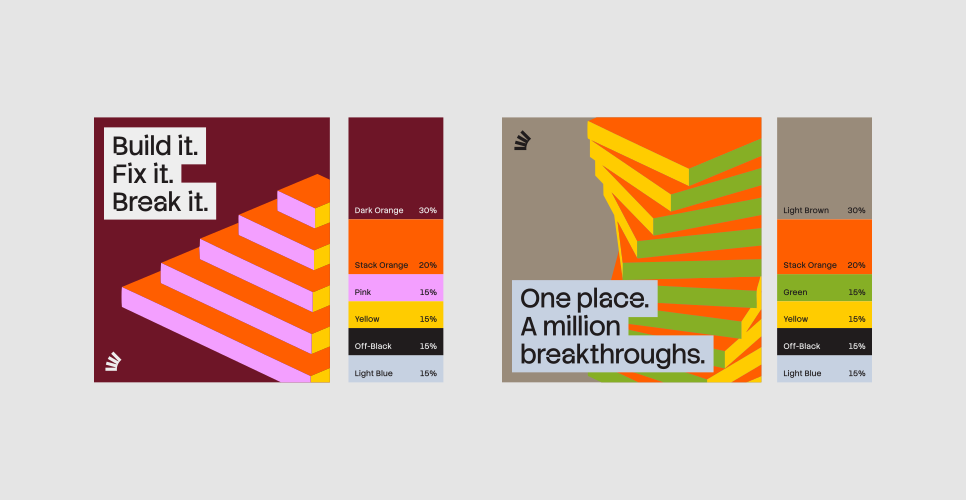
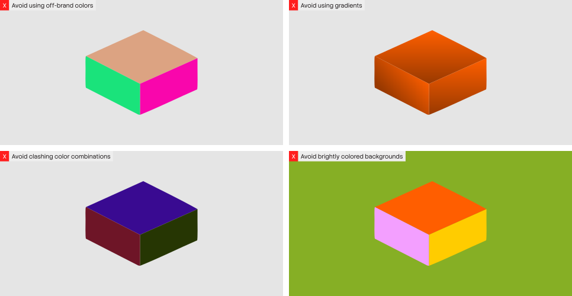

Our color palette sets the visual tone of the brand and ensures consistency across every platform. At its core is our distinct orange, a bold and instantly recognizable signature. This is supported by a balanced palette of primary and secondary colors that bring both vibrancy and sophistication. In this section, you'll find guidance on when and how to use each color, the hierarchy to follow, and important considerations to keep in mind.

## Color hierarchy

<ColorHierarchy />

## Color codes

<ColorCodes />

## Use of Stack orange

Orange is the most distinctive color in our palette, rooted in our original brand hue. It should have a presence across our designs, appearing whenever accessibility and layout allow. We use it with intention and at varying scales, ensuring it remains a consistent and recognizable part of our visual identity.

## Stack color combinations

When designing with a three-sided graphic stack, follow these guidelines for color selection.

## Background colors

For our backgrounds, we use neutral tones to offset the more saturated colors in the palette. This ensures that compositions feel balanced and never overwhelming. The only exception is Stack Orange, which we sometimes use in backgrounds as it’s our lead brand color. The selection below shows the colors we reserve specifically for backgrounds.

<ColorBackgrounds />

## Business vs. general palettes

Business and general audiences have different needs, and our color usage should reflect that. For business, we lead with the full palette to showcase energy and vibrancy. For a general audience, we take a more refined approach, toning down the brighter colors and using a more selective, sophisticated palette.

<ColorBusinessProduct />

## Stack Overflow business color usage

The examples below illustrate how we apply color for Stack Overflow Business. Hierarchy plays a key role to make sure the emphasis is in the right place, and the color balance is right. The more restrained approach adds more sophistication for the Stack Overflow Business audience.

## General color usage

The examples below show how we apply color for a general audience, such as Stack Overflow Public Platforms. Hierarchy plays a key role to make sure the emphasis is in the right place and the color balance is right.

## Label color guidance

Throughout our system, we use additional pops of color in labels. The labels should always complement the compositions they sit within. The examples below show the approved color combinations for labels.

<ColorLabels />

## Highlight headline color guidance

Color also comes through in our highlighted headlines. The guidance below shows the approved color combinations.

<ColorHeadlines />

## Things to avoid

## Accessibility

Accessible design starts with clear, readable text. In digital spaces, that means maintaining strong contrast between text and background. Learn more [about requirements here](https://stackoverflow.design/product/foundation/accessibility/).
